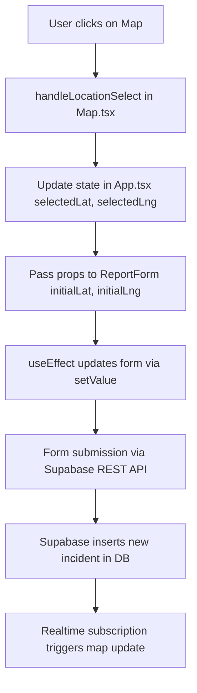

# Alerta Fuego – Wildfire Incident Tracker

**Alerta Fuego** is an open-source web application for real-time wildfire reporting and emergency coordination. It empowers citizens and response authorities to collaboratively report and monitor wildfire incidents using accurate location, risk, and timestamp data.

---

## Project Objectives

- Enable precise wildfire reporting through an interactive map
- Visualize active incidents in real time
- Automatically record timestamps and coordinates
- Lay the foundation for authority validation and analytics

---

## MVP – Core Features

### Interface Structure

- **Header**: Logo, dark/light mode toggle, quick report button
- **Main UI**: Split screen layout
  - Left: interactive map
  - Right: report form + incident details
- **Footer**: Educational disclaimer
- **Responsive**: Mobile-friendly modals or vertical layout

### Interactive Map

- Custom markers showing active wildfires
- Click-to-select location
- HTML5 geolocation support
- Automatic UTC + local timestamp
- Incident popups (coordinates, time, risk level)

### Public Reporting System

- No login required
- Smart report form:
  - Pre-filled coordinates
  - Auto-generated timestamp
  - Description and risk level selection
- Validation with React Hook Form + Zod
- Instant feedback: loading, success, and error states

### Database + Backend (Supabase)

- `incidents` table with:
  - `id`, `location` (PostGIS point), `timestamp_utc`, `risk_level`, `description`, `status`
- Auto-generated REST API
- Real-time updates via Supabase subscriptions
- PostGIS support for future spatial analysis

---

## Tech Stack

| Area           | Technology                      |
| -------------- | ------------------------------- |
| Frontend       | React 18, TypeScript, Vite      |
| Maps           | Leaflet.js, React-Leaflet       |
| Styling        | CSS Modules, CSS Variables      |
| Forms          | React Hook Form, Zod            |
| Geolocation    | HTML5 Geolocation API           |
| Backend / DB   | Supabase (PostgreSQL + PostGIS) |
| Realtime       | Supabase Subscriptions          |
| Authentication | Supabase Auth _(planned)_       |
| DevOps         | Vercel, GitHub                  |

---

## Project Structure

```
src/
├── components/           # Reusable UI components
│   ├── Header/           # Top bar with theme toggle
│   ├── Footer/           # Footer with disclaimer
│   ├── Layout/           # Split layout container
│   ├── Map/              # Leaflet map integration
│   └── ReportForm/       # Form to report incidents
├── types/                # Shared TypeScript types
│   └── index.ts
├── App.tsx               # Root component, central state
├── App.css               # Global styles
└── index.css             # CSS resets / base
```

### Data Flow

```
User clicks on map (Map.tsx)
     ↓
handleLocationSelect is triggered
     ↓
App.tsx updates state (selectedLat, selectedLng)
     ↓
Props passed to ReportForm (initialLat, initialLng)
     ↓
ReportForm.tsx uses useEffect to update form via setValue
```

### Component Architecture

```
App.tsx (Central state management)
├── Header/             # Theme toggle
├── Layout/             # Grid container
│   ├── Map/            # Interactive map (click handler)
│   └── ReportForm/     # Zod-validated form
└── Footer/             # Informational footer
```

### Flow Diagram (Mermaid)



---

## Feature Roadmap

### ✅ MVP Completed

- Public reporting (no login)
- Real-time map with location capture
- Risk level classification
- Auto timestamps (UTC + local)
- Form validation (Zod)
- Responsive UI + dark mode

### 🔜 Planned Features

1. **Authority Mode**

   - Login via Supabase Auth
   - Role-based validation dashboard

2. **Filters**

   - By risk level, status, date range, or location

3. **Timestamp Metadata**

   - ISO 8601, epoch, timezone, IP, user agent

4. **Notifications**

   - Toasts, internal alerts, email triggers

5. **UX/UI Enhancements**

   - Transitions, custom icons, accessibility

6. **Geospatial Analysis**

   - Distance calculations, fire clusters, area coverage

7. **Statistics + Exports**

   - Graphs, reports, CSV/JSON export

8. **Collaboration Tools**
   - Per-incident comments, authority chat, audit logs

---

## Getting Started

### Requirements

- Node.js 18+
- npm or yarn

### Installation

```bash
# Clone the repo
git clone https://github.com/Luisal182/Alerta-Fuego.git
cd Alerta-Fuego

# Install dependencies
npm install

# Configure environment
cp .env.example .env.local
# ➤ Add your Supabase credentials

# Run the dev server
npm run dev
```

---

## Contributing

Contributions are welcome! If you want to add a feature, report a bug, or improve documentation:

1. Fork the project
2. Create a branch (`git checkout -b feature/my-feature`)
3. Commit your changes
4. Push to your branch
5. Open a Pull Request

Feel free to open an issue to start a discussion.

---

## License

Distributed under the MIT License.

---

## Credits

Developed with ❤️ by **Luisal182**

Deployed via [Vercel](https://vercel.com) | Open Source on [GitHub](https://github.com/Luisal182/Alerta-Fuego)
